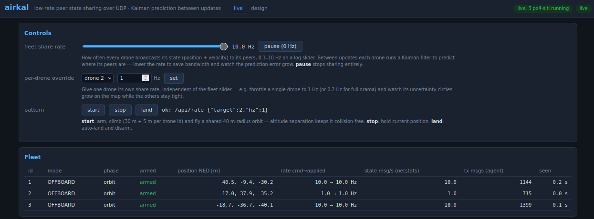
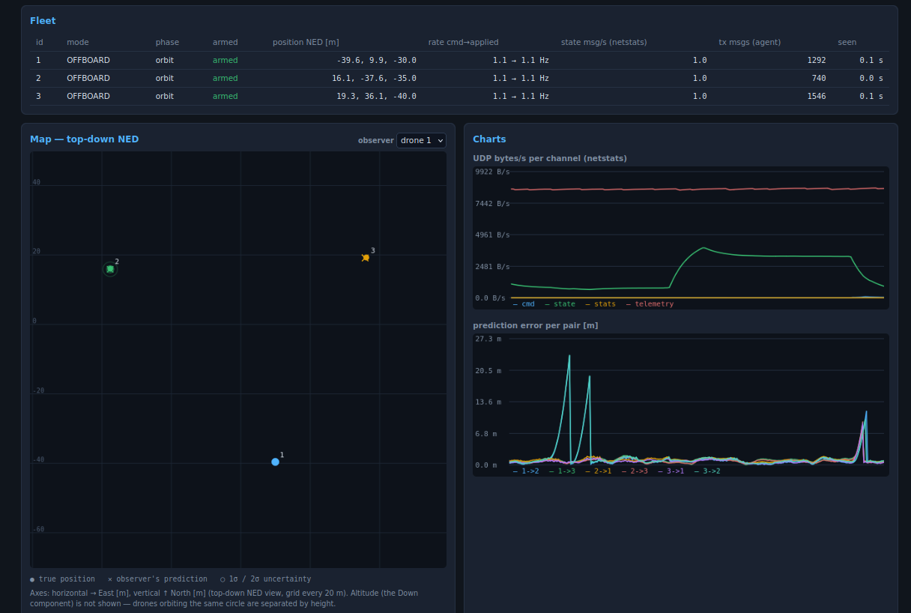
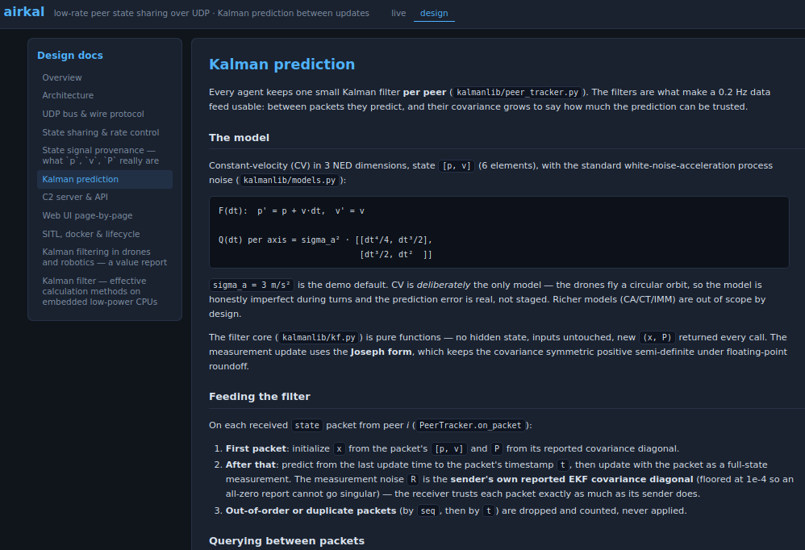

# "AirKal" / Learning-Exercise /  low-rate peer state sharing over UDP with Kalman prediction

A self-contained PX4 SITL demo of one concept: drones share their fused
GPS/position state with each other at a **low, runtime-controllable rate**
over UDP, and every receiver bridges the gaps with a small **Kalman filter
per peer** — position, velocity and an honestly growing uncertainty are
always available, regardless of the share rate. 
* v1 version planning [PLAN.md](PLAN.md) - currnet
* v2 version planning [PLAN2.md](plan2.md) - WIP
* v3 ? rf signals
* v4 ? vision assisted relative navigation





## Quickstart

```bash
make install        # 1. python venv + dependencies
make build          # 2. PX4 SITL docker image (one-time, ~10–30 min)
make test           # 3. unit test suite
make run N=3        # 4. SITL ×3 + agents ×3 + C2 + netstats
# open http://localhost:8080 → pattern "start" → play with the rate slider
make stats          # optional: live UDP traffic table in this terminal
make down           # stop everything, leave nothing behind
```

`make help` lists every target. `make status` shows what is running.





## What runs where

| Component | Runs as | Started by |
|---|---|---|
| `sitl/` PX4 (SIH quadcopter, headless, lockstep) | docker container ×N, host network | `make up N=3` |
| `agent/` per-drone process (EKF extraction, flight, share, track) | host process ×N | `make agents N=3` |
| `c2/` command & control (REST + WebSocket + web page) | host process ×1 | `make c2` |
| `netstats/` passive UDP traffic statistics | host process ×1 | `make stats` (CLI) / `make run` (background) |
| `web/` front page | your browser | http://localhost:8080 |

UDP channels (single-line JSON envelope on every message, loopback broadcast
by default — see `common/udpbus.py`):

| Port | Channel | Who → whom |
|---|---|---|
| 48000 | `state` | agent → all agents (the payload under study) |
| 48010 | `cmd` | C2 → agents (set_rate, pattern start/stop, land) |
| 48020 | `telemetry` | agent → C2 (5 Hz, display/eval only) |
| 48030 | `stats` | netstats → C2 (1 Hz) |

MAVLink: PX4 instance *i* ↔ agent *i+1* on `udp:14540+i`. C2 web/API:
`:8080` (`C2_PORT=… make run` to change).

The data path is peer-to-peer on the state channel; C2, netstats and the web
page are observers/command sources only — killing them never affects flight
or peer tracking.

## Controlling the share rate

From the web page (slider / per-drone override), or scripted:

```bash
curl -X POST http://localhost:8080/api/rate    -H 'Content-Type: application/json' -d '{"target":"all","hz":0.5}'
curl -X POST http://localhost:8080/api/pattern -H 'Content-Type: application/json' -d '{"target":"all","action":"start"}'
curl http://localhost:8080/api/fleet
```

`hz` is clamped to [0.1, 10]; `0` pauses sharing. Only the share rate over
the air changes — each drone's own PX4 navigation stays untouched.

## Verification

```bash
make verify N=3     # per instance: heartbeat + ODOMETRY @50 Hz with covariance
make smoke          # end-to-end on 1 drone: default rate ±10%, set_rate applied
make coverage       # unit tests + ≥80% gate on kalmanlib/ + common/
```

## Troubleshooting

- **`make up` says no heartbeat** — `docker logs airkal-sitl-1`; first boot
  takes a few seconds. The containers use host networking; ports 14540+i,
  18570+i must be free.
- **Agents log "waiting for PX4 heartbeat"** — start order matters:
  `make up` before `make agents` (or just `make run`).
- **No web updates** — is C2 running (`make status`)? The charts need
  netstats running too (`make run` starts it; standalone: `make stats`).
- **Different PX4 version** — edit `sitl/VERSION`, `make build`. The
  entrypoint auto-detects the SIH airframe id from the build.
- **PX4 tuning** — edit `sitl/params.override` (applied by agents over
  MAVLink at connect; runtime-settable parameters only, no rebuild).
- **Multi-host setup** — `AIRKAL_BUS_MODE=multicast` switches the bus to
  group 239.42.0.1 (see `common/udpbus.py`).

## Repository layout

```
Makefile            lifecycle: install/build/test/up/agents/c2/stats/run/down/…
sitl/               Dockerfile (pinned PX4), entrypoint, params.override, VERSION
common/             config.py, msg.py (wire schema), udpbus.py (UDP transport)
kalmanlib/          kf.py, models.py (CV), peer_tracker.py
agent/              main.py, mav.py, flight.py, broadcaster.py, tracker_io.py
c2/                 main.py, api.py, fanout.py, errors.py
netstats/           main.py, aggregate.py, cliview.py
web/                index.html, app.js, map.js, charts.js, style.css
scripts/            up/down/status/agents/c2/…, verify_sitl.py, smoke.sh
tests/              unit tests (kalmanlib, common, agent, c2, netstats)
```
